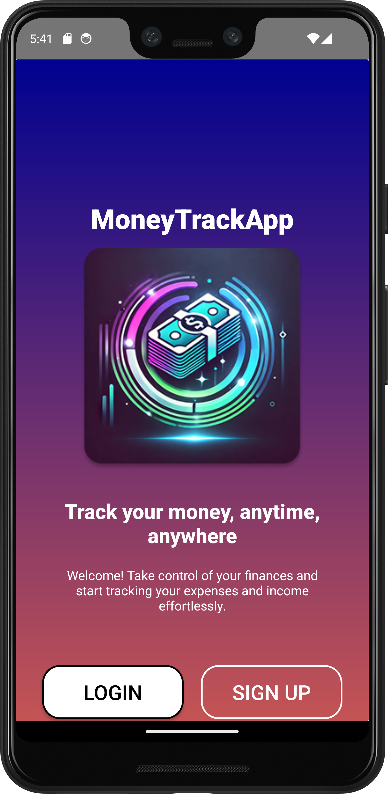
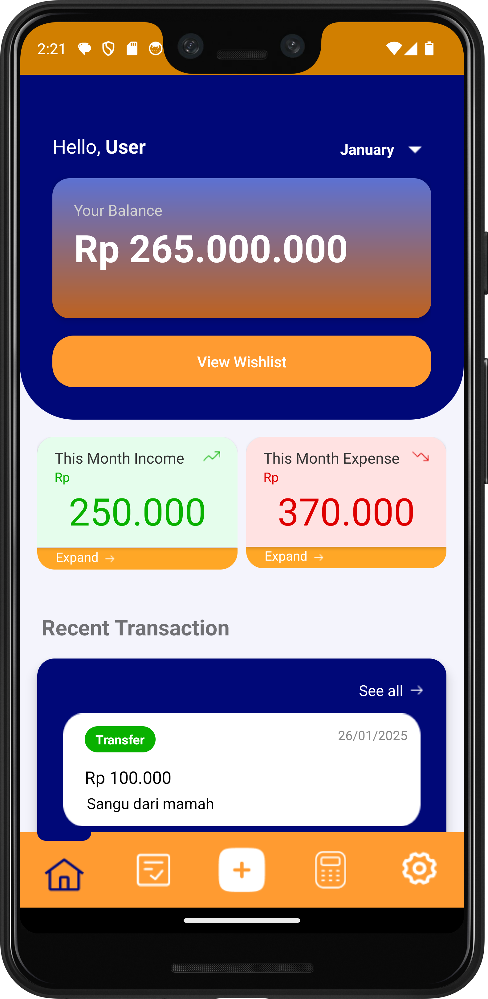
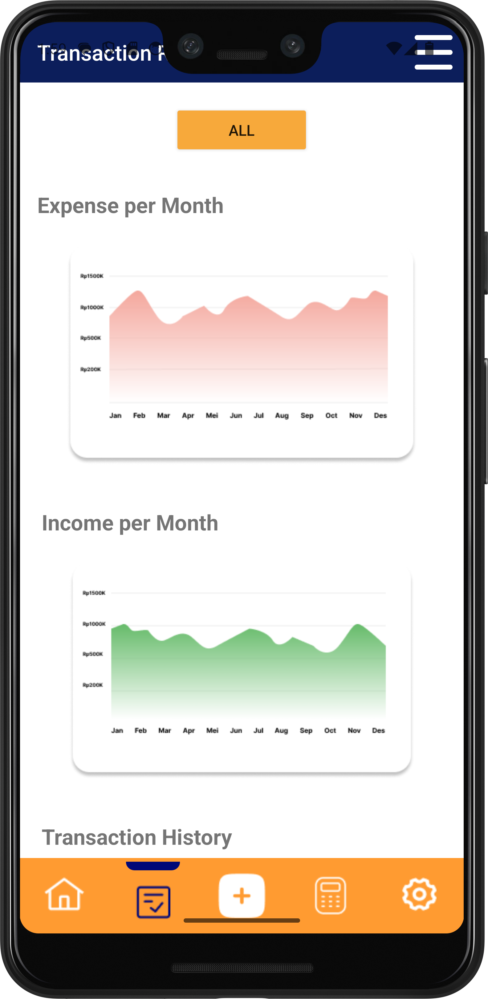
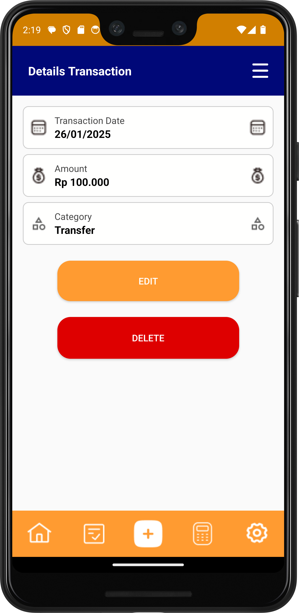

# UTP PAM
## Kontribusi setiap anggota

**Rarendra Adi Prabowo** (235150707111056):
- Membuat halaman dan fitur login user dimana user bisa menginputkan username dan passwordnya, serta masuk ke aplikasi
- Membuat fitur dan halaman register user. Di halaman ini user akan diminta menginputkan email, username, password dan confirm password. 
- Membuat fitur dan halaman forgot password dimana jika user menekan tombol forgot password di halaman login, user akan dibawa ke halama ini untuk mereset password.
- Membuat halalaman change password. Setelah user memasukkan OTP di halaman forgot password, user akan dibawa ke halaman ini dan menginputkan Password baru dan confirm baru untuk mereset passwordnya
- Membuat halaman wishlist untuk memasukkan wishlist yang user inginkan. Untuk menambahkan wishlsit user perlu menginputkan judul, total uang, dan deskripsi(opsional). Selain meanbahakna wishlist. Saya juga membuat fitur mengedit, menghapus dan melihat wishlsit
- Membuat desain untuk fungsional user(Profile), desain untuk budgeting, desain untuk kategori, serta desain untuk wishlist.

**Naufal Haris Michiels** (235150700111040):
- Membuat History Transaction
- Membuat Edit Transaction
- Membuat Delete Transaction
- Membuat Add Transaction
- Mengintegrasikan dan memperbaiki error saat integrasi ke main

**Muhammad Wildan Zhafiri** (235150707111048):
- Membuat fitur untuk manajemen kategori
- Membuat fitur edit kategori
- Membuat halaman untuk menambahkan kategori baru
- Membuat tampilan dashboard aplikasi
- Membuat desain tampilan aplikasi untuk bagian login, register, lupa password, ganti password

**Bekti Yuda Adi Pratama** (235150700111047):
- Budgeting View
- Add Budgeting
- Edit Budgeting
- Delete Budgeting

**Rafif Asrun Ramadhani** (235150701111046):
- Tampilan Settings 
- Edit Profile
- Choose Language

# MoneyTrackApp

## Description
MoneyTrackApp is a comprehensive financial tracking solution designed to help users manage their personal finances effectively. The application provides intuitive tools for expense tracking, budget management, and financial analysis.

## Features
- **Expense Tracking**: Record and categorize daily expenses
- **Budget Management**: Create and monitor budgets for different spending categories
- **Financial Reports**: Generate visual reports to analyze spending patterns
- **Savings Goals**: Set and track progress towards financial goals
- **Multi-platform Support**: Access your financial data across different devices

## Screenshots

### Login Screen

### Dashboard

### Transaction History

### Transaction Detail
